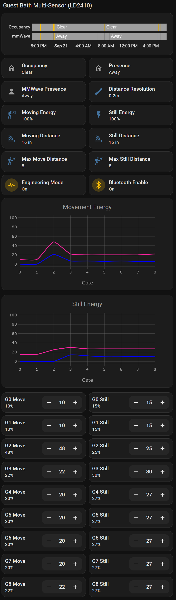
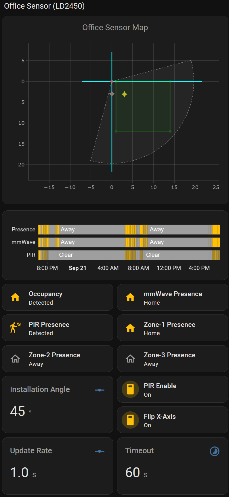

# Home Assistant

# Lovelace Configurations

Over time I found helpful lovelace configurations on the Internet. I really
need to do some research to give credit to the appropriate people.

# LD2410 Lovelace

The LD2410 allows you to set the sensitivity for both moving and still targets at different range bins.
While this is a flexible arrangement that allows you to tune the sensor to your space it is hard to visualize.
This Lovelace configuration makes it easier to visualize and set the range bin values to fit your environment.

{: .align-center}

Here is the [yaml](https://github.com/mikelawrence/esphome-indoor-multi-sensor-config/blob/main/lovelace/indoor-multi-sensor-ld2410-section.yml) for this Lovelace configuration.

# LD2450 Lovelace

The LD2450 allows you to set zones based on x and y coordinates. It can detect up to three targets and
you can configure up to three zones. This is even more difficult to visualize but luckily I have a Lovelace
config for this sensor too.

{: .align-center}

Here is the [yaml](https://github.com/mikelawrence/esphome-indoor-multi-sensor-config/blob/main/lovelace/indoor-multi-sensor-ld2450-section.yml) for this Lovelace configuration.

[back](./)
