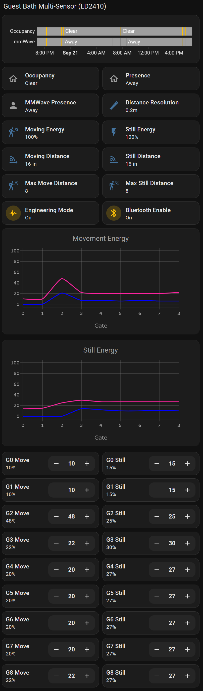
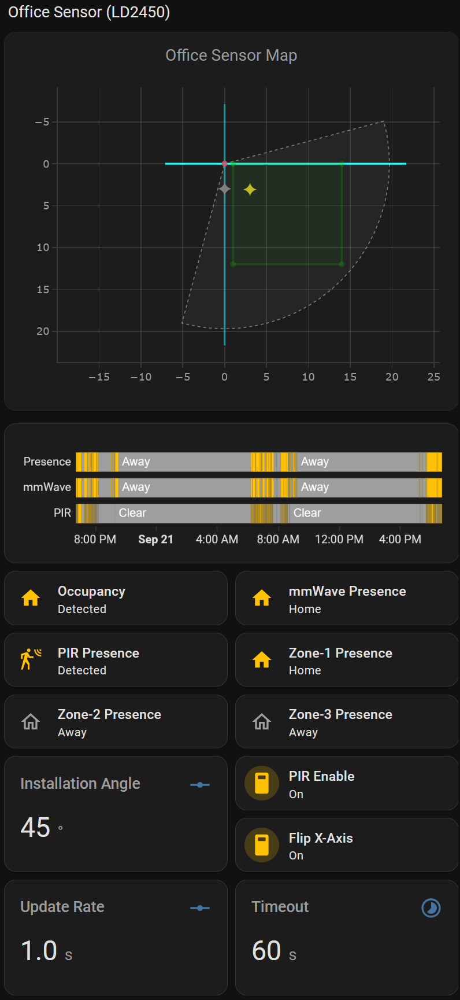

# Home Assistant

There are numerous entities presented to Home Assistant here is a complete list of each with a description.

## Controls

+ **Announcement Volume** (*Number*): The default volume for announcements over the speaker. The range is 0 - 100 with 100 as the maximum. Announcements change the volume to this value during an announcement. The previous volume will be restored once the announcement is complete.

+ **Enable Announcements** (*Switch*): When on Announcements are enabled. 

+ **Enable Auto Vent** (*Switch*): When on the Automatic Vent based on humidity and CO2 levels will be enabled. 

+ **Enable LED** (*Switch*): When on the Status LED will be enabled.

+ **Enable Nightlight** (*Switch*): When on the Status LED will act as a nightlight. The nightlight is controlled by light levels and automatically comes on when the room is dark.

+ **Enable PIR** (*Switch*): When on the PIR sensor will be enabled. The PIR sensor is included in presence detection when enabled.

+ **Media Player** (*Media Player*): Can be used to play any media from Home Assistant.

+ **Silience Alarms** (*Button*): When pressed will silence alarms for 3 hours or until the sensor is restarted.

+ **Status Light** (*Switch*): When set to on the Status Light will be forced on. This only applies to presence status. Include this switch in a group and it will turn on the Presense status LED when the group is on. Handy when other sensors are involved in room presense.

## Sensors

+ **Analog Current** (*Sensor*): This measures the current (A) the analog section is using. Updates every minute.

+ **Analog Power** (*Sensor*): This measures the current (A) the analog section is using. Updates every minute.

+ **Analog Voltage** (*Sensor*): This measures the current (A) the analog section is using. Updates every minute.

## Multi-Sensor Pkg-A LD2410

## Multi-Sensor Pkg-A LD2450

## Multi-Sensor Pkg-B C4001

## Multi-Sensor Pkg-B LD2410

## Multi-Sensor Pkg-B LD2450

# Lovelace Configurations

Over time I found helpful lovelace configurations on the Internet. I really
need to do some research to give credit to the appropriate people.

# LD2410 Lovelace

The LD2410 allows you to set the sensitivity for both moving and still targets at different range bins.
While this is a flexible arrangement that allows you to tune the sensor to your space it is hard to visualize.
This Lovelace configuration makes it easier to visualize and set the range bin values to fit your environment.

{: .align-center}

Here is the [yaml](https://github.com/mikelawrence/esphome-indoor-multi-sensor-config/blob/main/lovelace/indoor-multi-sensor-ld2410-section.yml) for this Lovelace configuration.

# LD2450 Lovelace

The LD2450 allows you to set zones based on x and y coordinates. It can detect up to three targets and
you can configure up to three zones. This is even more difficult to visualize but luckily I have a Lovelace
config for this sensor too.

{: .align-center}

Here is the [yaml](https://github.com/mikelawrence/esphome-indoor-multi-sensor-config/blob/main/lovelace/indoor-multi-sensor-ld2450-section.yml) for this Lovelace configuration.

[back](./)
